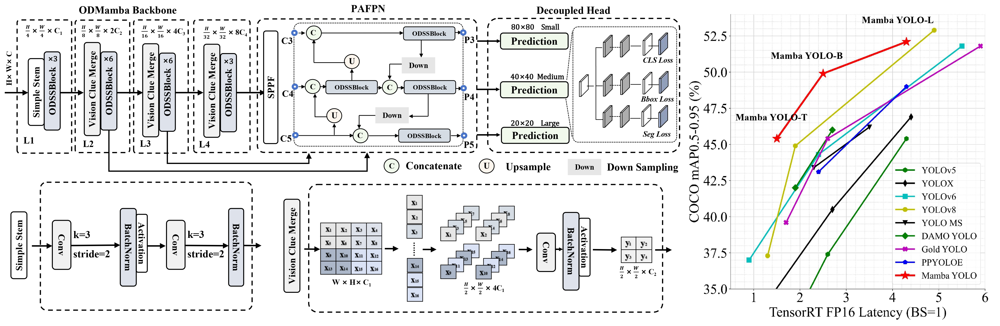
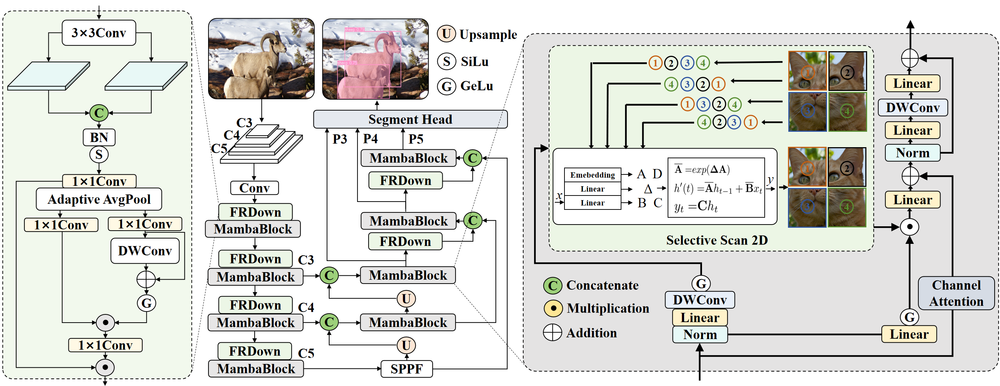
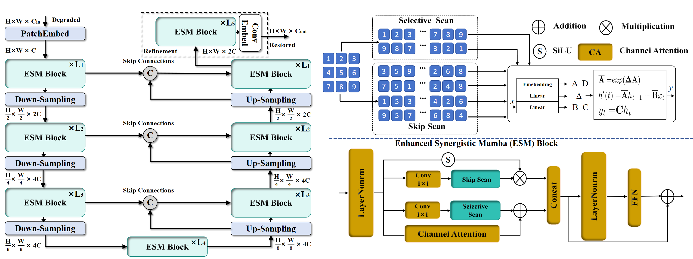

My current research interests are object detection, instance segmentation, and image restoration.

I am currently a postgraduate in Computer Science at [ZJNU](https://www.zjnu.edu.cn/main.htm).

# NEWS
## Paper is on the way
Our paper ["Rethinking Cross-Modality Fusion Mamba from a Frequency Domain Perspective"]() is on the way (under review).

Our paper ["Mamba YOLO: A Simple Baseline for Object Detection with State Space Model"]() is accepted by AAAI2025.

Our paper ["RestorMamba: An Enhanced Synergistic State Space Model for Image Restoration"]() is accepted by ICASSP2025.

Our paper ["MambaInst: Lightweight State Space Model for Real-Time Instance Segmentation"]() is accepted by ICASSP2025.

# Publications  

Mamba YOLO: A Simple Baseline for Object Detection with State Space Model
Zeyu Wang1,2,* , Chen Li1,2,∗, Huiying Xu1,2,†, Xinzhong Zhu1,2,3,†, Hongbo Li3
| **Authors**                         | **Affiliations**                                                                 |
|-------------------------------------|---------------------------------------------------------------------------------|
| **Zeyu Wang**, Chen Li, Huiying Xu, Xinzhong Zhu | College of Computer Science and Technology, Zhejiang Normal University, Zhejiang, 311231, China   Research Institute of Hangzhou Artificial Intelligence, Zhejiang Normal University, Hangzhou, Zhejiang, 311231, China |
| Hongbo Li                           | Beijing Geekplus Technology Co, Ltd, Beijing, 100101, China                      |

  {14797857499,LilSodaChen,xhy,zxz}@zjnu.edu.cn, jason.li@geekplus.com

MambaInst: Lightweight State Space Model for Real-Time Instance Segmentation

RestorMamba: An Enhanced Synergistic State Space Model for Image Restoration
